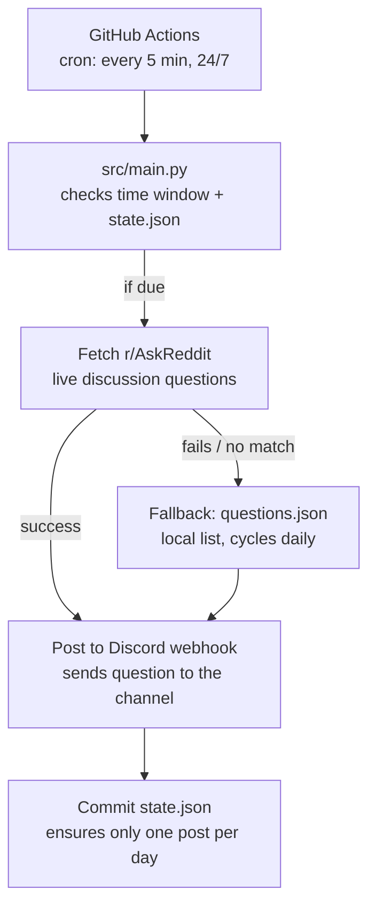

# WeAskYou

A daily discussion question, posted to a Discord channel automatically.

## Architecture

## Notes

- No persistent bot process. GitHub Actions polls every 5 minutes (the
  fastest interval it allows); `src/main.py` decides on each run
  whether it's actually time to post, based on `TARGET_TIME` and
  `state.json` (Europe/Amsterdam time, so daylight saving is handled
  automatically).
- Question source has a fallback chain: r/AskReddit first (live, no API
  key), `questions.json` if that fails or yields nothing suitable.
- `state.json` is committed back to the repo by the workflow after a
  successful post, which is what prevents double-posting on the same day.
- Delivery is a Discord webhook, not a bot with a gateway connection —
  intentional, since it avoids needing a 24/7-hosted process.

## Setup

1. Create a Discord webhook in the target channel (Channel Settings →
   Integrations → Webhooks).
2. Add it as a repository secret named `DISCORD_WEBHOOK_URL`.
3. Optionally set a repository variable `TARGET_TIME` (24h `HH:MM`,
   Europe/Amsterdam) to control what time the question posts. Defaults to
   `09:00`.
