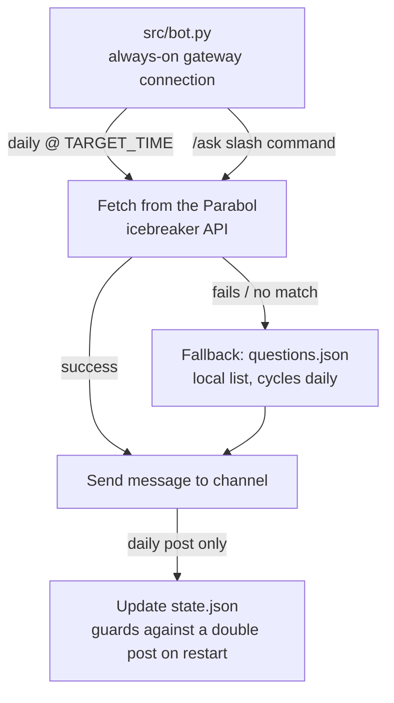

# WeAskYou

A Discord bot that posts a daily discussion question automatically, and
answers `/ask` with a fresh one on demand.

## Architecture

## Notes

- This is a real gateway bot (`discord.py`), not a webhook — it holds a
  persistent connection to Discord, so it needs an always-on host (a
  VPS, not GitHub Actions).
- The daily post is scheduled in-process with `discord.ext.tasks`, at
  `TARGET_TIME` (default `09:00`) in `Europe/Amsterdam` time via
  `zoneinfo`, so daylight saving is handled automatically.
- `/ask` is a slash command handled by the same process — no separate
  HTTP endpoint or reverse proxy needed, since gateway bots connect
  outward to Discord rather than the other way around.
- Question source has a fallback chain: the Parabol icebreaker API
  first (live, no key required — `icebreakers.parabol.co`),
  `questions.json` if that fails or returns nothing usable. This
  replaced an earlier r/AskReddit source, which Reddit's anti-bot
  system blocks for most cloud/hosting IP ranges (the kind a VPS has)
  unless you authenticate via OAuth.
- `state.json` on the VPS records the last date a daily post succeeded,
  so a restart on the same day doesn't post twice. It no longer needs
  to be committed back to the repo (that was only necessary for the old
  stateless GitHub Actions cron).
- The daily post's channel is picked in order: the channel set via the
  `/setchannel` slash command (stored in `state.json`, requires the
  "Manage Server" permission to run), then a channel named `general`
  in a server the bot is in. `/ask` always replies in the channel it
  was invoked from.

## Setup

1. Create an application at https://discord.com/developers/applications.
2. On the "Bot" tab, add a bot and copy its **Token**.
3. Generate an invite URL (OAuth2 → URL Generator, scopes `bot` and
   `applications.commands`; bot permission `Send Messages`) and add the
   bot to your server.
4. Copy `.env.example` to `.env` and fill in:
   - `DISCORD_BOT_TOKEN` — from step 2.
   - `DISCORD_GUILD_ID` (optional) — your server's ID, for instant
     slash-command sync while developing. Global sync (no guild ID)
     can take up to an hour to propagate.
   - `TARGET_TIME` (optional, 24h `HH:MM`, Europe/Amsterdam). Defaults
     to `09:00`.
5. Run it:
   - Locally: `pip install -r requirements.txt && python src/bot.py`
   - On a VPS: `docker compose up -d --build` (see `docker-compose.yml`)
